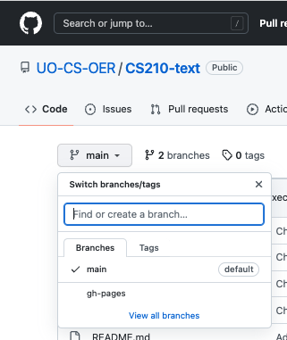

# Installing the tools you need

CS210-text (or a forked version under 
another title) is built with Jupyter Book. 
You need to create a Python virtual environment
and some supporting software to build
the book from sources. 

These instructions were tested on a MacOS
12.4 (Monterrey) system.  There will be some
minor differences if you use Linux, Windows, 
or a future version of MacOS.  _If you build in a different 
environment, please consider adding notes on differences
to this document._

## Step 1:  Virtual environment

Create a Python virtual environment. 

```commandline
python3 -m venv env
source env/bin/activate
```

Note:  If you are more familiar with Conda environments, you should
be able to accomplish the same thing with miniconda.  We document the
virtual environment (venv) approach because it is what we know.  _If
you successfully build the book with Conda, please add suitable
instructions for others._

If you use PyCharm or a similar IDE, you may need to alter the 
project configuration to use this virtual environment.  In PyCharm on
MacOS, bring up the Preferences menu, choose Project, and choose 
Project Interpreter.  Choose "new" and set to "existing environment",
where you should find the interpreter linked in your virtual 
environment.  You may need to close and reopen your project to make
this setting effective.  After the project configuration has been made,
the prompt in the Terminal window should always begin with `(env)`,
and the Python Console window should display the correct paths.  For
example, on the author's system the PyCharm Python Console window
shows: 

```commandline
/Users/michal/Dropbox/22F-210/Book/CS210-text/env/bin/python "/Users/michal/Library/Application Support/JetBrains/Toolbox/apps/PyCharm-P/ch-0/221.6008.17/PyCharm.app/Contents/plugins/python/helpers/pydev/pydevconsole.py" --mode=client --port=53807
```

## Step 2:  Install packages

The jupyter-book and ghp-import packages can be installed into the
virtual environment using pip. The file `requirements.txt` has
references to these packages.  For Python version 3.10, it should 
work "out of the box" like this: 

```commandline
pip install -r requirements.txt
```

## Step 3:  Test the build

You should be able to build the derived HTML version of the book from
the markdown sources with this command: 

```commandline
jupyter-book build Intro_to_CS
```

You can abbreviate "jupyter-book" to "jb". 

If it works without errors, the end of the output should look 
something like this: 

```commandline
Finished generating HTML for book.
Your book's HTML pages are here:
    Intro_to_CS/_build/html/
You can look at your book by opening this file in a browser:
    Intro_to_CS/_build/html/index.html
Or paste this line directly into your browser bar:
    file:///Users/michal/Dropbox/22F-210/Book/CS210-text/Intro_to_CS/_build/html/index.html        
```

## Step 4: Deploy

  Using ghp-import per
  [https://jupyterbook.org/en/stable/publish/gh-pages.html](https://jupyterbook.org/en/stable/publish/gh-pages.html)

### 4a: Create a branch for derived objects 

Create `gh-pages` branch in forked repository.  You can do this in 
the web interface to github:  Pull down "branches", search for a 
"gh-pages" branch, and click on the option to create the branch 
based on your "main" branch.   

This is a slight abuse of what git 
branches are intended for, but it is the standard way to create a
gitub pages site that you populate yourself (rather than using the
Jekyll process that github provides).



### 4b: Push derived objects to the `gh-pages` branch

This is what `ghp-import` does.   Again, it's not what a branch in
git is normally designed for, but it is idiomatic on github. 

`ghp-import -n -p -f Intro_to_CS/_build/html`.  

This copies the 
`_build` subdirectory into the `gh-pages` branch on github, 
replacing the copy of the `main` branch.  
End of output should look like 

```commandline
    Enumerating objects: 235, done.
    Counting objects: 100% (235/235), done.
    Delta compression using up to 8 threads
    Compressing objects: 100% (81/81), done.
    Writing objects: 100% (235/235), 2.27 MiB | 1.79 MiB/s, done.
    Total 235 (delta 59), reused 235 (delta 59), pack-reused 0
    remote: Resolving deltas: 100% (59/59), done.
    To https://github.com/UO-CS-OER/CS210-text
     + 7636e01...d5e3c75 gh-pages -> gh-pages (forced update)
```

## 4c: Github publishes the branch as a pages site

This step is automated in github with no action by you. 
Github will recognize 
_the contents of that branch as a github pages site, and create it. 
In a few minutes, an "environment" for github pages will appear in 
the github web interface:_ 


## 4d: Check your github pages site

Clicking on "github-pages" will bring you to a log of 
"deployments", i.e., a record of github recognizing an update to 
the `gh-pages` branch and publishing it.  A "view deployment" 
button on the right will take you to the actual site, which will 
have a name based on your repository name.  For example, for the 
University of Oregon repository at 
`https://github.com/UO-CS-OER/CS210-text`, the corresponding 
github pages site is 
`https://uo-cs-oer.github.io/CS210-text/`. 
