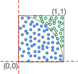

---
jupytext:
  formats: md:myst
  text_representation:
    extension: .myst
    format_name: myst
    format_version: 1.1
    jupytext_version: 1.10.3
kernelspec:
  display_name: Python 3
  language: python
  name: python3
---
# Projects

The project associated with this chapter is estimating the value of 
the mathematical constant π (pi) using
[_Monte Carlo Simulation_](
https://en.wikipedia.org/wiki/Monte_Carlo_method),
an application of random sampling to estimate a value. 

- [Estimating Pi](https://github.com/UO-CS210/pi)

An optional second project builds a _codec_ (functions for encoding 
and decoding) for compressing a word list using prefix encoding. 
The primary purpose of this project is to practice good _function 
hygiene_.  You may also be interested in 
the introduction to some basic concepts of compression. 

- [Compression by prefix coding](https://github.com/UO-CS210/prefix-compress)

