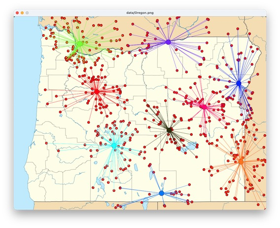

---
jupytext:
  formats: md:myst
  text_representation:
    extension: .myst
    format_name: myst
    format_version: 1.1
    jupytext_version: 1.10.3
kernelspec:
  display_name: Python 3
  language: python
  name: python3
---
# Project

The [wildfire clustering project](
https://github.com/UO-CS210/wildfire)
uses _k-means clustering_ to group wildfire records geographically.  
K-means clustering is an example of the _successive approximation_
computational technique for finding or optimizing a solution to a 
problem. 

In addition to successive approximation, the wildfire clustering 
project uses _parallel arrays_ to represent the evolving set of 
clusters, and values in one array (`list` in Python) as indexes to 
other arrays.  

