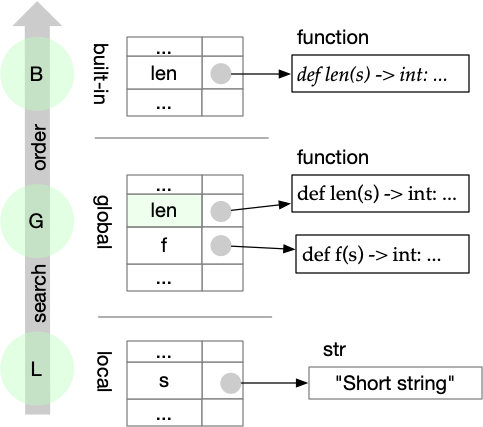
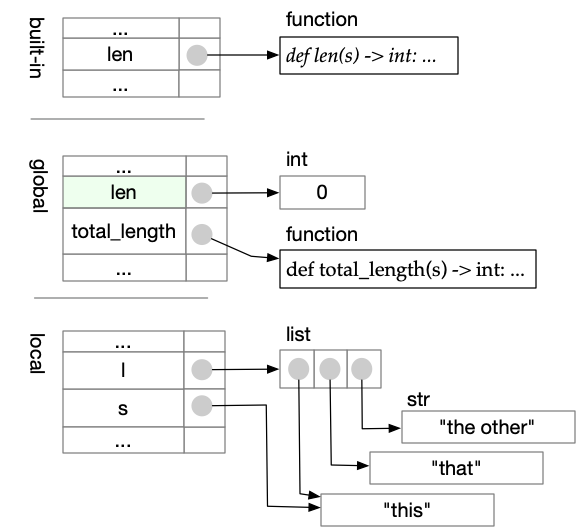
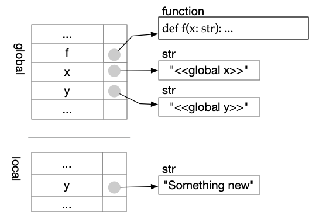
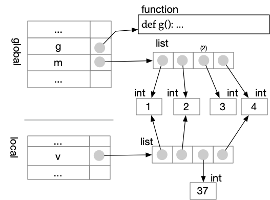

---
jupytext:
  formats: md:myst
  text_representation:
    extension: .myst
    format_name: myst
    format_version: 1.1
    jupytext_version: 1.10.3
kernelspec:
  display_name: Python 3
  language: python
  name: python3
---
#  Scopes

If we have a variable `x`, that variable may 
exist in more than one namespace.  Some of these namespaces are
in _stack frames_, created when a function is called.  Python 
searches namespaces in a 
particular order, which determines which `x` it finds.

Python always searches in this order: 

- The _local_ scope.  This is the namespace in the top stack frame, 
  which generally corresponds to the function that is currently 
  executing.  If a function is not executing (e.g., you are 
  executing code within a source file that is not part of any 
  function), then the local scope will be the namespace of the 
  module (see below).
- The _enclosing_ scope.  Later you may find it useful to define 
  functions within other functions.  For now the enclosing scope 
  will be the same as the global scope. 
- The _global_ scope.  This is a namespace of the module (source 
  file) of the code that is currently executing.  It is where our 
  functions and global variables live.
- The _builtin_ scope.  This is a namespace for the builtin 
  functions (and some other things) that are always available in 
  Python.  For example, when you type `len("abc")`, Python usually 
  finds `len` in the _builtin_ scope. 

This is called _LEGB resolution order_.  To remember it, imagine 
that a football player's dominant leg is
"leg A", and their other leg is "leg B".  A skilled football (soccer)
player must practice kicking with leg B.  

When a name exists in more than one of these scopes, Python
uses the name it 
finds first. We say the other occurrences of the name are _shadowed_,
i.e., covered up and hidden.  For example: 

```{code-cell} python3
# Shadow the built-in len function
def len(s: str) -> int: 
    """Don't do this.  Avoid shadowing built-ins!"""
    return 21
   
def f(s: str) -> int: 
    return 2 * len(s)

print(f("Short string"))
```

Python looks first in the _local_ namespace, but does not find `len`.  
There is no enclosing namespace, so it next looks in the _global_ 
namespace, and finds function `len` defined in this module.  It does 
not look farther, so it uses the `len` function defined in this 
module instead of the built-in `len` function. 



It can be hard to remember and avoid all the built-in names. Try as 
I may to avoid it, I often accidentally shadow a 
built-in function with a variable.  This can lead to confusing error 
messages. 

```{code-cell} python3
:tags: ["raises-exception"]

len = 0  # Oops

def total_length(l: list[str]) -> int: 
    """Total length of all the strings in l"""
    tot = 0
    for s in l: 
        tot += len(s) 
    return tot
    
print(total_length(["this", "that", "the other"]))
```



When Python complains that some type is "not callable", it is a 
strong clue that we have accidentally shadowed a function with a 
variable. 

## Which variables are local?

Since a function can use both global variables and local variables, 
how can we tell which is which?  If we assign a value to a variable
(bind it) _anywhere_ in a function, Python will create a
variable with that name in the local scope of the function. 
If we use the variable but do not bind it within the function,
Python will not create a local variable, so it will find a global 
variable instead.  In other words, the local variables of a function 
are the variables that are bound within the function. 

```{code-cell} python3
x = "<<global x>>"
y = "<<global y>>"

def f():
    """Access both local and global variables"""
    y = "Something new"       # y is bound here! 
    print(f"The value of x is '{x}' while executing f")
    print(f"The value of y is '{y}' while executing f")

print(f"x is '{x}', y is '{y}' before calling f()")
print("========  Calling f  ========")
f()
print("========  After call to f ====")
print(f"x is '{x}', y is '{y}' after calling f")
```




Binding `y` within `f` makes `y` a local variable 
_throughout_ f, even before the assignment that binds it.  Notice 
what happens if we move the assignment after the print statements: 

```{code-cell} python3
:tags: ["raises-exception"]

x = "<<global x>>"
y = "<<global y>>"

def f():
    """Access both local and global variables"""
    # assignment to y has not been made yet
    print(f"The value of x is '{x}' while executing f")
    print(f"The value of y is '{y}' while executing f")
    y = "Something new"       # y is bound here! 

print(f"x is '{x}', y is '{y}' before calling f()")
print("========  Calling f  ========")
f()
print("========  After call to f ====")
print(f"x is '{x}', y is '{y}' after calling f")
```

## Formal arguments are local variables

When we call a function `f`, we bind the values of _actual 
arguments_ to the _formal arguments_ of f.  These bindings create 
local variables, just as if we had written an assignment statement 
for each formal argument. 

```{code-cell} python3
x = "<<global x>>"
y = "<<global y>>"

def g(x: str):
    """x will be bound by a call, and y by assignment, 
    so both x and y will be local variables.
    """
    y = x 
    print(f"The value of x is '{x}' while g is executing")
    print(f"The value of y is '{y}' while g is executing")

print(f"x is {x}, y is {y} before calling g(y)")
print("========  Calling g ========")
g(y)
print("========  After call to g ====")
print(f"x is '{x}', y is '{y}' after calling g(y)")    
```

Here `x` is made local by binding of the actual argument to a local 
argument, and `y` is made local by binding in an assignment.  
Although both `x` and `y` are local, they are both aliases of the 
global `y`. 


## Modifying an element does not bind the collection

It may seem that setting an element of a list or other collection is 
an "assignment to" a variable, but it does not make a new binding to 
the variable itself. 

```{code-cell} python3
m = [1, 2, 3, 4]

def g(): 
    """This function does NOT bind m; 
    it only modifies an element of m.
    """
    m[2] = 37
    print(f"Within g the value of m is now {m}")
    
print(f"Before g() the value of m is {m}")
g()
print(f"After g() the value of m is {m}")
```

This can be confusing, but it makes sense if you think about the way 
Python executes `m[2] = 37`.  First it finds `m`, then it finds 
element `2` of `m` and changes that.  `m` is still associated with 
the same reference to the same list, unchanged.  The value of `m` 
has been modified, but the binding of `m` has not changed.


If we did not want to modify the global `m` within `g`, we could 
avoid it by making a copy.  Most collection types (`list`, `dict`, 
and some others) have a `copy` method. 

```{code-cell} python3
m = [1, 2, 3, 4]

def g(): 
    """This function binds v
    to a copy of the global m.
    """
    v = m.copy()
    v[2] = 37
    print(f"Within g the value of v is now {v}")
    print(f"Within g the value of m is still {m}")
    
print(f"Before g() the value of m is {m}")
g()
print(f"After g() the value of m is {m}")
```



What would happen if we tried to make a copy with `m = m.copy()` 
instead of introducing a new variable `v`?   It will not work! 
Recall that binding a variable _anywhere_ in a function makes it a 
local variable _everywhere_ in the function.  

```{code-cell} python3
:tags: ["raises-exception"]

m = [1, 2, 3, 4]

def g(): 
    """This function binds attempts to bind
    local m to a copy of global m, but it fails
    because every reference to m is to the local m. 
    """
    m = m.copy()
    m[2] = 37
    print(f"Within g the value of m is now {m}")
    
g()
```
The local
`m` shadows the global `m`.  Thus `m = m.copy()`
tries to make a copy of the local variable, which will fail because 
the local variable hasn't been given a value yet.  


## Default Arguments: A Binding _Gotcha_

Occasionally we have to think carefully about scope and about the 
_time_ of binding to avoid unintended effects.  Some infamous
[Python "gotchas"](https://docs.python-guide.org/writing/gotchas/) 
result from unintended effects through shared bindings. 

A Python function can have keyword arguments as well as positional 
arguments, and those keyword arguments can have default values.  The 
keyword argument is bound to its default value just once, when the 
function is defined.   This seems fine ... 

```{code-cell} python3
def stars(n: int, initial=[]) -> list[str]:
    """Should return list of n stars.  Oops."""
    if n == 0:
        return initial
    initial.append("*")
    return stars(n-1, initial)

print(stars(3))
```
 Handy!  But watch out ... 

```{code-cell} python3
print(stars(2))
```

Although the formal argument `initial` is local to function `stars`, 
the default value is bound to a mutable value whose scope is the 
module in which the function appears.  It is just as if we had written: 

```{code-cell}  python3
sneaky = []
def stars(n: int, initial=sneaky) -> list[str]:
    """Should return list of n stars.  Oops."""
    if n == 0:
        return initial
    initial.append("*")
    return stars(n-1, initial)

print(stars(3))
print(stars(2))
```

Variable `sneaky` is bound to an empty list just once, and then
that binding is copied to `initial` each 
time we call `stars` without providing an explicit value for 
`initial`.  Many an hour of 
debugging has been spent diagnosing unexpected effects of such 
shared bindings.   

## Recap

The scope rules in Python are simple, but their consequences can be 
confusing.  There are just two rules to remember: 

- Python searches for names in _LEGB_ order, *L*ocal, *E*nclosing, 
  *G*lobal,  *B*uilt-in.  (So far we have seen just _LGM_, but
  "LEG-B" is easier to pronounce and thus easier to remember.)
- The *L*ocal variables of a function are those that have been 
  _bound_ through an explicit assignment or through argument passing.

Everything else follows from these two rules. 