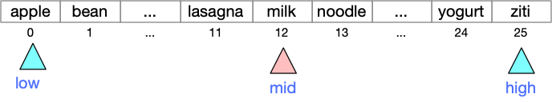
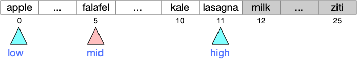
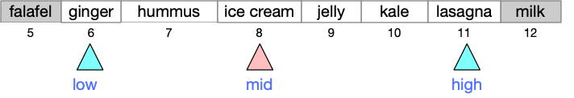
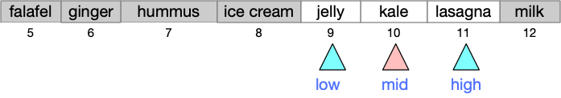
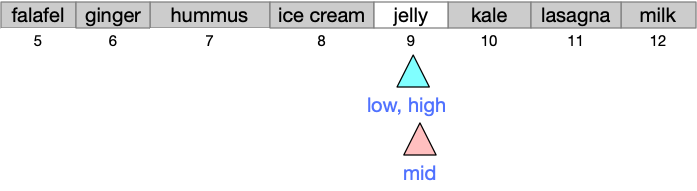
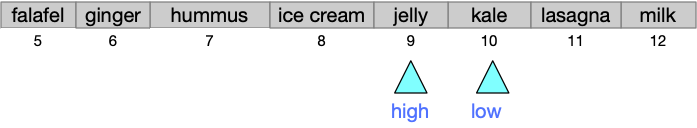

---
jupytext:
  formats: md:myst
  text_representation:
    extension: .myst
    format_name: myst
    format_version: 1.1
    jupytext_version: 1.10.3
kernelspec:
  display_name: Python 3
  language: python
  name: python3
---

# Binary Search

Suppose we wish to determine whether `schnoggle` appears in a list 
of 40,000 valid English words.  If the list of words is in a 
sequential data file as text, it seems the best we can do is linear 
time relative to the length of the word list, because at minimum we 
must read each entry from the file.  

But suppose that instead of checking just 'schnoggle', we wish to 
check thousands of combinations of letters as we search for a legal 
word in word game like Scrabble or Boggle. It 
will be worthwhile to read the file just once and store it in a list.
If we sort the list (just once!), we can thereafter search for each 
candidate word very quickly --- much more quickly than a linear search. 

## A running example

While binary search is important mainly for large lists, we will use 
a short list of foods to illustrate it.  

```{code-cell} python3
FOODS = ["apple", "bean", "corn", "date", 
  "egg", "falafel", "ginger", "hummus", "ice cream", 
  "jelly", "kale", "lasagna", "milk", "noodle", "olive", 
  "pizza", "quiche", "ramen", "spinach", "tiramisu", 
  "udon", "vindaloo", "watermelon", "xôi", "yogurt", "ziti" ]
```

The list is sorted, which for these words corresponds to 
alphabetical order.  (Alphabetical order and sorted order differ 
when we mix upper and lower case and characters outside the
English alphabet.)

```{code-cell} python3
def is_ordered(l: list[str]) -> bool: 
  """True if the list is in sorted order"""
  prior = l[0]
  for word in l[1:]: 
      if prior < word: 
          prior = word
      else:
          return False
  # Checked every pair, they were all in order
  return True
  
is_ordered(FOODS)
```

The simplest way to determine whether a string is an element of 
FOODS is with a linear search: 

```{code-cell} pythone
def  linear_search(s, lst: list[str]) -> bool: 
    """Returns True iff there is an element of lst equal to s."""
    for el in lst: 
        if s == el:
            return True
    return False
    
print(f"Expecting False: {linear_search('kabob', FOODS)}")
print(f"Expecting True: {linear_search('kale', FOODS)}")
```

We can do much better. 

## Divide and conquer

Suppose we are looking for `'kale'` in the ordered list of foods. 
Suppose we begin by checking roughly in the middle of the list, at 
position 12. 



We would find 'milk'.  We would note `'milk' > 'kale'`,
and since the list is in order, we know that all of the items from 
position 12 to the end of the list are also greater than 'kale'.  We 
can eliminate all of them, and continue searching only elements 0..11.



Checking again around the middle, we would find 'falafel'.  Since 
'falafel' < 'kale', we can eliminate all the elements from 'apple' 
to 'falafel'. 



Next we probe 'ice cream', and since 'i' < 'k' we eliminate the 
range from 'ginger' through 'ice cream'. 



Probing between 'jelly' and 'lasagna', we finally find 'kale'.  

Had we been searching instead for 'kabobs', we would have eliminated 
'kale' and 'lasagna' and checked 'jelly'. 



Since 'jelly' < 'kabobs', 
we would conclude that 'kabobs' must appear after 'jelly', i.e., in 
the range of positions from 10 to 9.  That is an empty range, so
we would conclude there are 
no kabobs in our list of foods. 



That is the tactic that binary search uses.  Initially we 
search the whole list, but at each step we either find the value we 
are searching for, or we eliminate half of the remaining range. If 
the whole range is eliminated (e.g., a range from 10..9),
then we conclude that value is not in the list.

```{code-cell} python3
def binary_search(s, lst: list[str]) -> bool: 
    """Returns True iff there is an element of lst equal to s,
    provided lst is ordered.
    """
    # Initially we search the whole list
    low = 0
    high = len(lst) - 1
    while low <= high: 
        print(f"Searching in range {low}..{high}")
        mid = (low + high) // 2
        probe = lst[mid]
        print(f"Probing '{probe}' at position {mid}")
        
        if s == probe: 
            return True
        if probe < s:
            # Eliminate lower half of range
            low = mid + 1
        else: 
            # Eliminate higher half of range
            high = mid - 1
            
    # When low > high, we have eliminated the whole range 
    return False
  
print("Checking for kale")
print(f"Expecting True: {binary_search('kale', FOODS)}")


print("\n\nChecking for kabobs")
print(f"Expecting False: {binary_search('kabobs', FOODS)}")

print("\n\nChecking for almond")
print(f"Expecting False: {binary_search('almond', FOODS)}")
```

## How fast is it? 

Since binary search eliminates half of the search range on each 
iteration of the loop, the total time it requires for a search of 
$n$ items is proportional to $\lg n$, the logarithm base 2 of $n$.  
Here are some example values of $\lg n$: 

| $n$ | $\lg n$ |
|-----|---|
| 256 | 8 |
| 1024| 10 |
| 4096 | 12 |
| 16,777,216 | 20|
 | 4,294,967,296 | 32 |
|18,446,744,073,709,551,616 | 64 |

The attraction of binary search over linear search
for very large lists should be apparent. 

The main limitation of binary search is that the list must already be 
ordered (sorted).  If you are going to search a list just once, it 
does not make sense to sort it (which takes somewhat longer than a 
linear search) just to prepare it for a binary search.  It can make 
sense if you can sort the data once in preparation for searching it 
many times.  

## Variations 

Binary search is a fundamental technique that appears in many 
applications, with several variations.  We might search a list of 
(key, value) pairs to find keys, returning values, or keys and 
values might be stored in parallel arrays.

If you continue with 
computer science courses through 
intermediate data structures (e.g., CS 313 at U. Oregon), you will learn to 
construct self-balancing binary search trees, which are closely
related to binary search.  Database systems, which are ubiquitous in 
data processing,  also use self-balancing 
trees.

In our 
[Boggle project](https://github.com/UO-CS210/06-Boggle), 
we use a variation that can return a third value, in addition to 
"found" or "not found".


  