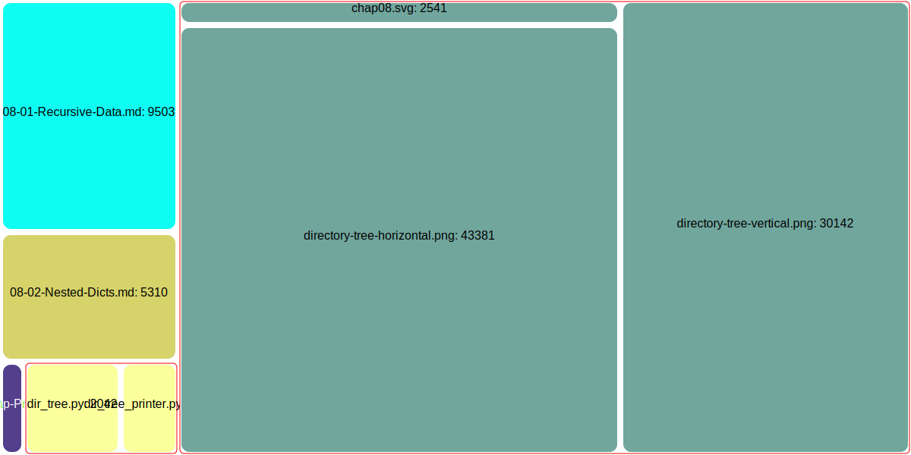

---
jupytext:
  formats: md:myst
  text_representation:
    extension: .myst
    format_name: myst
    format_version: 1.1
    jupytext_version: 1.10.3
kernelspec:
  display_name: Python 3
  language: python
  name: python3
---
# Treemap Visualization of Recursive Data

The [project](https://github.com/UO-CS210/Treemap)
accompanying this chapter asks you to create a visual representation 
of recursive data.  

- Initially you will recursively divide a _flat_ 
(that is, not nested) list of integers into groups 
  represented by rectangular areas.  
- Next you will recursively divide a _nested list_ of integers into 
  groups represented by rectangular areas, preserving the grouping
  in each nested list.
- Finally, you will process a structure of nested dictionaries to 
  visualize grouping of elements of different sizes.

In the final version, you will be able to process a JSON structure like 
this summary of files used to build this chapter: 

```json
{
    "08-01-Recursive-Data.md": 9503,
    "08-02-Nested-Dicts.md": 5310,
    "08-03-Treemap-Project.md": 971,
    "Chap08.json": 0,
    "Samples": {
        "dir_tree.py": 2042,
        "dir_tree_printer.py": 1217
    },
    "img": {
        "chap08.svg": 2763,
        "directory-tree-horizontal.png": 43381,
        "directory-tree-vertical.png": 30142
    }
}
```

This JSON file was produced by
[Samples/dir_tree.py](Samples/dir_tree.py).
When processed by a sample solution to our treemap project, we can 
obtain a visualization showing the relative sizes of files: 



Treemaps are not effective visualizations for all kinds of 
quantitative data (e.g., it is not easy to determine the relative 
sizes of the two .png files), but they can provide a good 
at-a-glance comparison, especially for hierarchically structured data.  
For example, we can quickly see that the 
bitmap graphics files (.png) are much larger than the source text 
files (.md), but the scalable vector graphic (.svg) image is 
relatively compact. Management of file space was among the original 
applications of the treemap visualization format, and has been used 
in commercial and open source applications like
[Disk Inventory X](https://www.derlien.com/)
for MacOS,
[WinDirStat](https://windirstat.net/)
for Windows, and 
[QDirStat](https://github.com/shundhammer/qdirstat)
for Linux. 

## Project repository

[https://github.com/UO-CS210/Treemap](
https://github.com/UO-CS210/Treemap)

